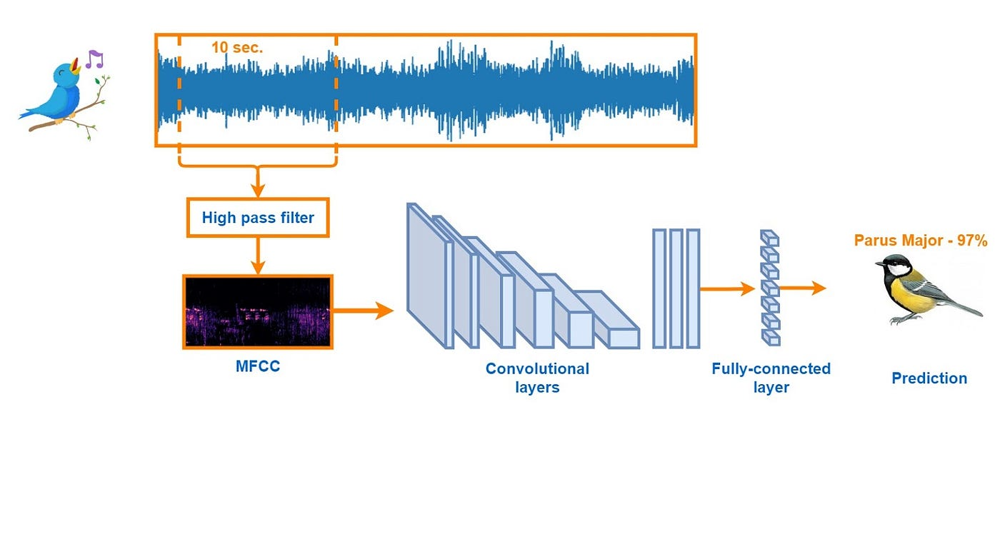

# BirdClef    - Bioacoustic Monitoring

The BirdClef    project represents a significant leap in bioacoustic monitoring, providing a passive, cost-effective approach to study endangered bird populations through their calls. Leveraging machine learning, our goal is to automate the identification of bird species, a task traditionally dependent on manual annotation and specialized expertise. This project addresses the unique challenge of dealing with rare and endangered species, particularly those found in Hawai'i, where conventional methods face limitations. By conducting thorough data exploration, preprocessing, and implementing a DenseNet architecture for model building, we have created a system capable of reliably classifying bird species with limited training data. Our approach not only demonstrates the potential of deep learning in bioacoustics but also addresses critical conservation needs.

---

## Skills & Technologies Utilized:

- **Data Exploration & Preprocessing**: Utilized Pandas, NumPy, and Librosa for comprehensive data analysis, cleaning, and feature extraction.
  
- **Deep Learning**: Employed TensorFlow and Keras for building and training the DenseNet architecture.
  
- **Convolutional Neural Networks**: Implemented DenseNet architecture for effective feature extraction and classification.
  
- **Model Evaluation**: Utilized Macro F1-score for assessing the model's performance on multi-class classification.
  
- **Data Visualization**: Leveraged Matplotlib and Seaborn for visualizing data distributions, trends, and model performance metrics.
  
- **Signal Processing**: Applied Short Term Fourier Transform and Mel Frequency Cepstral Coefficients (MFCC) for audio feature extraction.
  
- **Data Augmentation**: Utilized Peak Sampling and Spectrogram Plotting techniques to enhance the diversity of training data.
  
- **Optimization**: Used Adam Optimizer to efficiently minimize the loss function during model training.
  
- **Git & Version Control**: Managed the project using Git and hosted the repository on GitHub for collaboration and version tracking.
  
- **Documentation**: Wrote comprehensive documentation in Markdown, including this ReadMe, to provide clear insights into the project structure, methodologies, and results.

